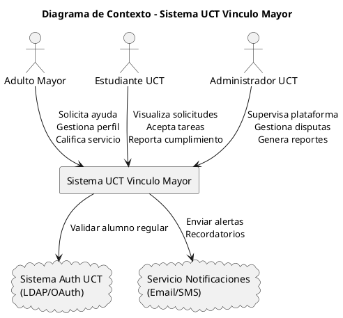
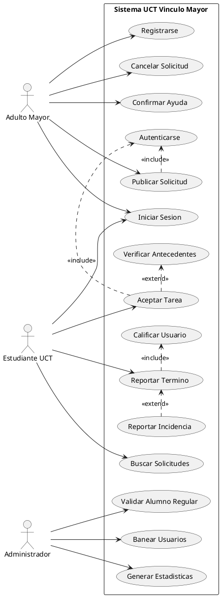
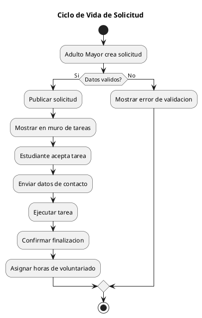
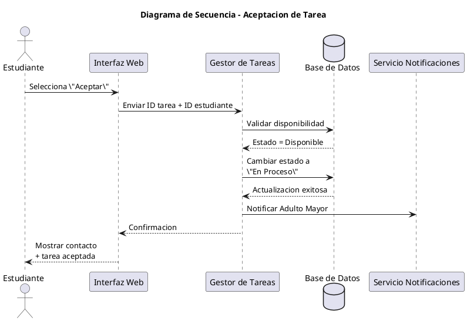
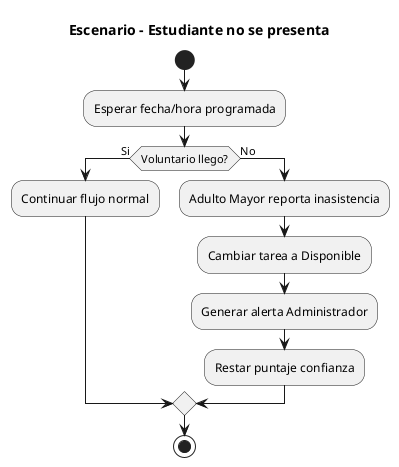

# SRS: Sistema UCT-Vínculo Mayor

**Universidad Católica de Temuco**  
**Facultad de Ingeniería**

## Autores
- Benjamin Sebastian
- Francisco Valderrama
- Sebastian Rivera
- Axel Gonzalez

## Docente
Guido Octavio Mellado Bravo

## Plataforma de Voluntariado para el Adulto Mayor
Temuco, Chile  
16 de abril de 2026

---

# Índice

1. [Contexto](#1-contexto)
2. [Stakeholders y actores](#2-stakeholders-y-actores)
3. [Diagrama de contexto](#3-diagrama-de-contexto)
4. [Diagrama de Casos de Uso](#4-diagrama-de-casos-de-uso)
5. [Diagramas de comportamiento](#5-diagramas-de-comportamiento)
6. [Requerimientos funcionales](#6-requerimientos-funcionales)
7. [Requerimientos no funcionales](#7-requerimientos-no-funcionales)
8. [Reglas de negocio](#8-reglas-de-negocio)
9. [Coherencia general del sistema](#9-coherencia-general-del-sistema)

---

# 1. Contexto

El contexto de este documento es definir los requisitos funcionales, no funcionales y las reglas de negocio para el desarrollo del sistema **UCT-Vínculo Mayor**. Esta plataforma web facilitará la conexión entre adultos mayores de la comuna de Temuco que requieren asistencia en tareas cotidianas y estudiantes de la UCT dispuestos a realizar labores de voluntariado.

## Alcance del sistema

El sistema permitirá la gestión de perfiles, la publicación de solicitudes de ayuda (compras, trámites, acompañamiento) y el emparejamiento con voluntarios validados a través de los sistemas institucionales de la universidad.

No incluye:
- Gestión de pagos.
- Servicios médicos especializados.

## Descripción General

### Dominio del Problema y Contexto

En la ciudad de Temuco, una parte significativa de la población de adultos mayores enfrenta barreras físicas y tecnológicas para realizar tareas diarias (compras, pagos de servicios, movilidad básica).

Por otro lado, la comunidad estudiantil de la UCT busca espacios de vinculación con el medio y responsabilidad social.

### Necesidad

Existe una desconexión logística entre quienes necesitan ayuda y quienes pueden brindarla de forma segura y confiable.

El sistema actúa como un puente tecnológico que garantiza:
- La identidad de los voluntarios.
- La veracidad de las solicitudes.

## Limitaciones y Oportunidades

### Limitación

La brecha digital del adulto mayor puede requerir que un tercero (familiar o tutor) interactúe con la plataforma.

### Oportunidad

Integración con el sistema de autenticación centralizado de la UCT para asegurar que todos los voluntarios son alumnos regulares activos.

---

# 2. Stakeholders y actores

## Stakeholders (Interesados)

### Dirección de Vida Estudiantil UCT
- Nivel de implicación: Alto.
- Buscan métricas de participación estudiantil y garantizar la seguridad del proceso.

### Instituciones Regionales (ej. SENAMA Araucanía)
- Nivel de implicación: Medio.
- Posibles patrocinadores que necesitan asegurar que el trato a los adultos mayores cumpla con estándares éticos.

## Actores del sistema

### 1. Adulto Mayor (Beneficiario)
- Tipo: Actor primario externo.
- Objetivo: Solicitar asistencia para tareas diarias de forma sencilla y segura.
- Necesidades:
  - Interfaz de alta accesibilidad.
  - Tipografía grande.
  - Flujos de pocos clics.

### 2. Familiar / Cuidador (Proxy)
- Tipo: Actor secundario.
- Objetivo: Gestionar solicitudes en nombre de un adulto mayor que no posee habilidades digitales.

### 3. Estudiante Voluntario
- Tipo: Actor primario interno (comunidad UCT).
- Objetivo: Encontrar solicitudes que se ajusten a su disponibilidad de tiempo y ubicación en Temuco.
- Responsabilidades:
  - Cumplir con la tarea aceptada de manera ética y puntual.

### 4. Administrador de sistema
- Tipo: Actor de soporte.
- Objetivo:
  - Moderar la plataforma.
  - Resolver disputas.
  - Auditar cuentas.
  - Extraer reportes de impacto.

---

# 3. Diagrama de contexto

El Diagrama de Contexto define los límites del sistema, identificando qué está dentro de la aplicación y qué entidades externas interactúan con ella.

## Descripción de la estructura

### Proceso Central
- Sistema “Vínculo UCT”.

### Entidades Externas

#### Adulto Mayor
- Solicita ayuda.
- Califica el servicio.
- Gestiona su perfil.

#### Estudiante UCT
- Visualiza solicitudes.
- Acepta tareas.
- Acredita su cumplimiento.

#### Sistema de Autenticación UCT (LDAP/OAuth)
- Valida que el estudiante sea alumno regular.

#### Administrador UCT
- Supervisa la plataforma.
- Gestiona disputas.
- Genera reportes.

#### Servicio de Notificaciones (Email/SMS)
- Envía alertas de tareas aceptadas o recordatorios.

---

# Diagrama de Contexto

## Objetivo del diagrama

Este diagrama representa las entidades externas que interactúan con el sistema
UCT Vinculo Mayor y cómo fluye la información entre ellas.

El flujo principal se centra en la gestión de solicitudes de ayuda realizadas
por adultos mayores y aceptadas por estudiantes voluntarios validados por la UCT.

## Flujo principal de aceptación de tareas

1. El Adulto Mayor crea una solicitud.
2. El sistema publica la solicitud.
3. El Estudiante UCT visualiza tareas disponibles.
4. El estudiante acepta una tarea.
5. El sistema valida al estudiante mediante autenticación institucional.
6. El sistema notifica al Adulto Mayor.
7. El Administrador supervisa incidencias y reportes.

## Descripción de Límites e Interacciones Externas

### A. Adulto Mayor (Entidad Externa)

#### Entradas al Sistema
- Datos de perfil.
- Creación de solicitudes.
- Calificaciones del servicio recibido.

#### Salidas del Sistema
- Notificaciones de tarea aceptada.
- Perfil del estudiante asignado.
- Alertas de recordatorio.

### B. Estudiante UCT (Entidad Externa)

#### Entradas al Sistema
- Credenciales institucionales.
- Aceptación de tareas.
- Reporte de tarea finalizada.
- Evidencia de cumplimiento.

#### Salidas del Sistema
- Catálogo de solicitudes disponibles.
- Historial de horas de voluntariado.
- Certificados de participación.

### C. Sistema de Autenticación UCT (Sistema Externo)

#### Interacción
El sistema no gestiona las contraseñas de los alumnos directamente.

Envía una consulta al LDAP o API de la universidad para confirmar que el RUT ingresado pertenece a un alumno regular activo.

### D. Administrador UCT (Entidad de Control)

#### Entradas al Sistema
- Parámetros de configuración.
- Gestión de disputas.
- Moderación de contenido.

#### Salidas del Sistema
- Reportes consolidados de impacto social.

## Límites del Sistema (Scope)

### Fuera de Alcance
- El sistema no procesa pagos.
- El sistema no provee transporte físico.
- La validación de salud mental de los estudiantes queda sujeta a los registros previos de la universidad.

---

# 4. Diagrama de Casos de Uso

Este diagrama detalla las funcionalidades del sistema y cómo los actores interactúan con ellas.

## Identificación de Actores

### Adulto Mayor
- Actor principal.
- Usuario que genera la demanda de ayuda.

### Estudiante UCT
- Actor principal.
- Usuario que ofrece el servicio voluntario.

### Administrador
- Actor de soporte.
- Encargado de la integridad de los datos.

## Relaciones de Casos de Uso

### Gestionar Solicitud
- Incluye `<<include>>` Autenticarse.

### Aceptar Solicitud
- El estudiante elige una tarea.
- Si la tarea es de alta complejidad, puede disparar un `<<extend>> Verificar Antecedentes`.

### Finalizar Tarea
- Incluye obligatoriamente la calificación del estudiante.

## Descripción UML

### Capa de Usuario
- Registrarse.
- Iniciar Sesión.
- Editar Perfil.

### Capa Operativa (Adulto Mayor)
- Publicar Solicitud.
- Cancelar Solicitud.
- Confirmar Ayuda Recibida.

### Capa Operativa (Estudiante)
- Buscar Solicitudes por Categoría.
- Postular a Tarea.
- Reportar Término.

### Capa Administrativa
- Validar Certificado de Alumno Regular.
- Banear Usuarios.
- Generar Estadísticas de Impacto Social.

---

# Diagrama de Casos de Uso

## Objetivo del diagrama

Este diagrama describe las funcionalidades principales del sistema y las
interacciones entre los actores y los casos de uso asociados.

El flujo principal modela cómo un estudiante acepta una tarea publicada
por un adulto mayor dentro de un entorno seguro y validado.

## Flujo principal de aceptación de tareas

1. El usuario inicia sesión.
2. El Adulto Mayor publica una solicitud.
3. El Estudiante busca solicitudes disponibles.
4. El estudiante acepta una tarea.
5. El sistema valida permisos y disponibilidad.
6. El estudiante ejecuta la tarea.
7. Ambas partes finalizan y califican el proceso.

## Descripción de los Casos de Uso y Relaciones

### A. Casos de Uso Principales

#### UC03: Publicar Solicitud de Ayuda
El Adulto Mayor ingresa la descripción de lo que necesita.

Ejemplo:
> “Compras en supermercado”.

#### UC06: Aceptar Tarea
El estudiante visualiza el muro y decide tomar una responsabilidad.

Esto cambia el estado de la tarea:
- Pendiente → En Curso.

#### UC07: Finalizar Tarea
Punto de cierre donde ambas partes confirman que el servicio se realizó.

### B. Relaciones Técnicas (UML)

#### Relación `<<include>>`
- Publicar Solicitud y Aceptar Tarea incluyen obligatoriamente Autenticarse.
- Finalizar Tarea incluye Calificar Usuario.

#### Relación `<<extend>>`
- Reportar Incidencia extiende a Finalizar Tarea.

#### Generalización / Herencia
El estudiante se autentica vía Sistema Auth UCT (LDAP), mientras que el adulto mayor puede usar un registro local o simplificado.

## Matriz de Roles y Permisos

| Casos de uso | Adulto Mayor | Estudiante UCT | Administrador |
|---|---|---|---|
| Registrarse | ✓ | ✓ (Vía UCT) | - |
| Publicar Ayuda | ✓ | - | - |
| Aceptar Cargo | - | ✓ | - |
| Cerrar Tarea | ✓ | ✓ | - |
| Moderar Contenido | - | - | ✓ |
| Generar Certificados | - | ✓ (Recibe) | ✓ (Emite) |

## Notas Técnicas para la Implementación

### Validación de Actor
El sistema debe detectar automáticamente si el correo es `@uct.cl` para asignar el rol de estudiante.

### Seguridad
El caso de uso “Aceptar Tarea” debe activar una máscara de privacidad que solo libere la dirección del adulto mayor al estudiante asignado.

---

# 5. Diagramas de comportamiento

## Diagrama de Actividad: Ciclo de Vida de una Solicitud

### Flujo Principal

1. El Adulto Mayor crea una solicitud.
2. El sistema valida la solicitud.
3. La solicitud aparece en el “Muro de Tareas”.
4. Un estudiante selecciona la tarea.
5. El sistema envía los datos de contacto.
6. Se realiza la tarea.
7. Ambas partes confirman el cierre.

---

# Diagrama de Actividad - Ciclo de Vida de Solicitud

## Objetivo del diagrama

Este diagrama modela el flujo operativo completo de una solicitud,
desde su creación hasta la confirmación final de la tarea.

Representa la lógica principal del negocio asociada al voluntariado.

## Flujo principal de aceptación de tareas

1. El Adulto Mayor crea una solicitud.
2. El sistema valida la información.
3. La solicitud se publica.
4. Un estudiante acepta la tarea.
5. El sistema comparte información de contacto.
6. Se ejecuta la tarea.
7. Ambas partes confirman el cierre.
8. El sistema acredita horas de voluntariado.

## Diagrama de Secuencia: Aceptación de Cargo

### Participantes
- Estudiante.
- Interfaz Web.
- Controlador de Tareas.
- Base de Datos.

### Flujo
1. El estudiante selecciona “Aceptar”.
2. Se envía el ID de tarea y estudiante.
3. El sistema valida disponibilidad.
4. Se consulta el estado.
5. La base de datos retorna “Disponible”.
6. Se cambia el estado a “En Proceso”.
7. Se actualiza la tarea.
8. Se muestra confirmación y contacto.
9. Se notifica al Adulto Mayor.

## Proceso de Aceptación y Validación

### Participantes y Roles

| Participante | Rol |
|---|---|
| Estudiante | Usuario autenticado |
| Interfaz Web | Capa de presentación |
| Gestor de Tareas | Lógica de negocio |
| Base de Datos | Persistencia |
| Servicio Notif. | Correos y alertas |

---

# Diagrama de Secuencia - Aceptación de Tarea

## Objetivo del diagrama

Este diagrama representa la interacción temporal entre los componentes
del sistema durante el proceso de aceptación de una tarea.

Permite visualizar el flujo de mensajes entre frontend, backend,
base de datos y servicios de notificación.

## Flujo principal de aceptación de tareas

1. El estudiante selecciona una tarea disponible.
2. La interfaz envía la solicitud al backend.
3. El sistema valida disponibilidad.
4. La base de datos cambia el estado de la tarea.
5. El sistema notifica al Adulto Mayor.
6. Se entrega confirmación al estudiante.

## Análisis de Escenarios Alternativos y Excepciones

### A. Escenario: El Estudiante no se presenta

#### Detección
El Adulto Mayor marca un botón de “El voluntario no llegó” después de 24 horas del plazo.

#### Acción del Sistema
- La tarea vuelve a “Disponible”.
- Se genera una alerta automática al Administrador.

#### Penalización
Se resta puntaje de confianza al perfil del estudiante.

### B. Escenario: Cancelación de último minuto

#### Regla de Negocio
Si el estudiante cancela con menos de 2 horas de anticipación:
- El sistema bloquea nuevas tareas por 48 horas.

#### Flujo
El Gestor de Tareas verifica:
- Timestamp actual.
- Timestamp programado.

## Resumen Técnico del Comportamiento

### Concurrencia
El sistema utiliza bloqueo de base de datos para evitar que dos estudiantes acepten la misma solicitud.

### Persistencia
Todos los cambios de estado quedan registrados en una tabla de auditoría.

### Privacidad
Los datos del Adulto Mayor solo se liberan cuando la tarea cambia a “En Progreso”.

## Conclusión del Diseño

El sistema se define como:
- Un flujo transaccional seguro.
- Una plataforma orientada a proteger la integridad del adulto mayor.
- Un sistema que valida el esfuerzo del estudiante.

---

# Escenario Alternativo - Inasistencia del Estudiante

## Objetivo del diagrama

Este diagrama representa el comportamiento del sistema frente a
situaciones excepcionales relacionadas con incumplimientos.

Permite modelar reglas automáticas de penalización y recuperación
de tareas disponibles.

## Flujo alternativo de aceptación de tareas

1. El estudiante acepta una tarea.
2. El sistema espera ejecución.
3. El voluntario no se presenta.
4. El Adulto Mayor reporta incidencia.
5. El sistema libera nuevamente la tarea.
6. Se penaliza al estudiante.
7. El Administrador recibe una alerta.

---

# 6. Requerimientos funcionales

## Módulo de Gestión de Usuarios

### RF-USR-01
El sistema debe permitir el registro de estudiantes validando dominios:
- `@uct.cl`
- `@alu.uct.cl`

### RF-USR-02
El sistema debe permitir el registro de perfiles:
- Adulto Mayor.
- Tutor.

Requiriendo:
- RUT válido.

### RF-USR-03
El sistema debe autenticar usuarios mediante correo y contraseña.

### RF-USR-04
El sistema debe suspender automáticamente a un estudiante tras acumular tres inasistencias injustificadas.

## Módulo de Gestión de Solicitudes

### RF-SOL-01
Permitir crear solicitudes seleccionando categorías predefinidas.

### RF-SOL-02
La solicitud debe incluir:
- Fecha.
- Hora.
- Descripción.
- Ubicación.

### RF-SOL-03
El sistema debe impedir solicitudes:
- Fuera del rango 08:00–20:00.
- Con menos de 24 horas de anticipación.

### RF-SOL-04
El creador puede editar o cancelar antes de aceptación.

## Módulo de Emparejamiento y Asignación

### RF-EMP-01
Mostrar solicitudes filtrables y ordenadas por:
- Categoría.
- Cercanía.
- Fecha.

### RF-EMP-02
Permitir visualizar:
- Categoría.
- Descripción.
- Comuna.

Sin mostrar:
- Dirección exacta.
- Teléfono.

### RF-EMP-03
Permitir aceptar solicitudes.

### RF-EMP-04
Impedir aceptar más de 2 solicitudes activas.

### RF-EMP-05
Liberar dirección y contacto solo después de aceptación.

## Módulo de Ejecución y Cierre de Tareas

### RF-EJE-01
Permitir cancelar tareas aceptadas.

Si la cancelación ocurre con menos de 4 horas:
- Registrar inasistencia injustificada.

### RF-EJE-02
Permitir marcar tareas como “Completada”.

### RF-EJE-03
Enviar confirmación al Adulto Mayor/Tutor.

### RF-EJE-04
Permitir evaluaciones opcionales.

### RF-EJE-05
Aprobar automáticamente tareas tras 48 horas sin respuesta.

### RF-EJE-06
Sumar horas solo tras confirmación.

---

# 7. Requerimientos no funcionales

## Usabilidad y Accesibilidad

### RNF-USA-01 (Accesibilidad Visual)
La interfaz debe cumplir WCAG 2.1 nivel AA.

Debe permitir:
- Alto contraste.
- Escalado tipográfico al 200%.

### RNF-USA-02 (Diseño Responsivo)
El sistema debe adaptarse a:
- Mobile First para estudiantes.
- Tablets y escritorio para adultos mayores.

### RNF-USA-03 (Navegación Intuitiva)
La creación de solicitudes debe completarse en máximo 3 pasos.

## Seguridad y Privacidad

### RNF-SEG-01 (Cifrado en Tránsito)
Toda comunicación debe utilizar HTTPS/TLS.

### RNF-SEG-02 (Almacenamiento de Credenciales)
Las contraseñas deben almacenarse utilizando:
- bcrypt.
- Argon2.

### RNF-SEG-03 (Protección de Datos Personales)
Cumplimiento de la Ley 19.628.

## Rendimiento y Disponibilidad

### RNF-REN-01 (Tiempos de Respuesta)
El dashboard debe cargar en menos de 3 segundos.

### RNF-REN-02 (Concurrencia)
Soportar al menos 200 usuarios concurrentes.

### RNF-DIS-01 (Disponibilidad)
Disponibilidad mínima del 99.5%.

## Mantenibilidad y Arquitectura

### RNF-MAN-01 (Estructura del Código)
Implementar:
- Clean Architecture.
- Clean Code.

### RNF-MAN-02 (API Documentada)
La API RESTful debe estar documentada mediante:
- OpenAPI.
- Swagger.

### RNF-MAN-03 (Control de Versiones)
El proyecto debe utilizar Git.

---

# 8. Reglas de negocio

## Reglas Generales

### RN-01 (Naturaleza del Servicio)
El voluntariado es estrictamente gratuito.

### RN-02 (Exclusividad de Voluntarios)
Solo estudiantes regulares pueden participar.

### RN-03 (Límite Geográfico)
El voluntariado se limita a:
- Temuco.
- Padre Las Casas.

## Reglas de Operación de Tareas

### RN-04 (Horario Operativo)
Las tareas presenciales deben realizarse entre:
- 08:00 y 20:00.

### RN-05 (Anticipación de Solicitudes)
Las solicitudes deben ingresarse con mínimo 24 horas de anticipación.

### RN-06 (Límite de Tiempo)
Duración máxima:
- 4 horas continuas por día.

### RN-07 (Restricción de Labores)
No se permiten tareas de:
- Riesgo físico.
- Riesgo legal.
- Medicina.
- Electricidad.
- Conducción.

## Reglas de Conducta y Penalización

### RN-08 (Plazo de Cancelación)
Cancelar con menos de 4 horas cuenta como inasistencia.

### RN-09 (Suspensión por Inasistencia)
Tres inasistencias generan suspensión.

### RN-10 (Bloqueo Preventivo)
Reportes graves suspenden automáticamente al voluntario.

## Reglas de Evaluación y Acreditación

### RN-11 (Confirmación de Conformidad)
Las horas solo se acreditan tras confirmación.

### RN-12 (Aprobación por Omisión)
Tras 48 horas sin respuesta:
- La tarea se aprueba automáticamente.

---

# 9. Coherencia general del sistema

## Análisis de Coherencia y Robustez

### Alineación Estratégica

| Regla | Impacto |
|---|---|
| RN-01 | Garantiza naturaleza voluntaria |
| RN-07 | Evita riesgos legales y accidentes |

## Diseño Centrado en el Usuario

### A. Adulto Mayor

#### Usabilidad
Implementación de WCAG 2.1.

#### Gestión por Terceros
Inclusión de Tutor/Familiar.

#### Privacidad
La dirección permanece protegida hasta aceptar la tarea.

### B. Estudiante

#### Validación de Identidad
Uso de OAuth/SSO UCT.

#### Equilibrio Académico
Máximo 4 horas diarias.

## Resiliencia del Flujo

### Escenario de Incumplimiento

#### RN-08 / RN-09
Tras la tercera inasistencia:
- El sistema ejecuta baneo automático.

### Escenario de Olvido

#### RN-12: Aprobación por Omisión
Después de 48 horas:
- Se otorgan las horas automáticamente.

## Verificación de Validez Técnica

### El sistema es:
- Coherente.
- Completo.
- Realista.

## Sugerencia de mejora

### RN-13: Botón de Pánico o Reporte Express

Se recomienda agregar:
- Suspensión preventiva automática.
- Revisión prioritaria por Administrador UCT.
- Priorización de la seguridad del adulto mayor.

